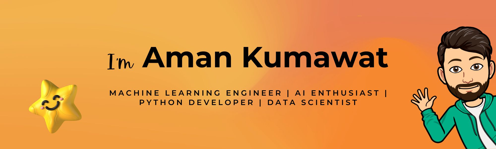

# Hi there 👋

## About Me ✨

  

### 😊 I'm a Machine Learning Enthusiast, Software Developer, and Digital Artist.

🌱 Currently pursuing my B.Tech in Mechanical Engineering at MNIT Jaipur

🔭 I've found my passion in AI and ML. I love solving complex problems and building meaningful projects using my skills in programming and data science. 

🎨 I also have a deep interest in creative digital work and photography.

🌐 Have a look at **[CodeLore](https://codelore.infinityfreeapp.com/)**—my portfolio of projects and blogs!

### 🌟 Follow me on:

&nbsp; 
&nbsp; 

## 🧑‍💻 On Going Projects

- ### **[ML from Scratch](https://github.com/amankumawat-567/MLfromScratch)**
    - A NumPy-based library implementing various machine learning algorithms for classification, clustering, and regression tasks.
    - **Aim 🎯** : To add more Alogorithms to it.

- ### **[Stock Trader](https://github.com/amankumawat-567/StockTrader)**
    - A reinforcement learning model for stock trading using deep Q-learning.
    - **Aim 🎯** : Increase relivent input parametrs and add a better algorithm for selling buying

## ✍️ Blogs  
I write about **Machine Learning**, **Deep Learning**, and **Data Science**. Some of my latest blogs:  

📌 **[Beyond the Cave: AI’s Search for the Ideal Reality](https://codelore.infinityfreeapp.com/2024/09/06/ai-and-ideal-reality/)**  
📌 **[AI Myths Busted: It’s Not Magic, It’s Logic!](https://codelore.infinityfreeapp.com/2024/06/19/ai-myths-busted/)**  
📌 **[Support Vector Regression(SVR): How to Use SVMs to Model the Unknown](https://codelore.infinityfreeapp.com/2024/04/12/svr/)**

[for more >>](https://codelore.infinityfreeapp.com/crush-complexity/)

## 💻 My Tech Stack
 

 

 
 
 
 
 

 
 
 

## 📊 GitHub Stats:

 

---

**💡 Always open to collaborations!** Let's connect and build something amazing 🚀

---

<h2>
CODELORE

</h2>